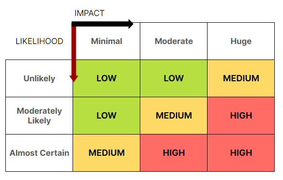

# Penetration Testing

## Objectives
- Understand the role of a penetration tester
- Learn how to identify and assess different attack vectors
- Understand some techniques used by penetration testers
- Practise/try some of the techniques used

## Programme

  
**Attacking an application without prior authorization is illegal!**

### What is penetration testing?

- Process:
   - **Mapping/Reconnaissance**
   > Learning the system, identifying potential threat vectors and generally familiarising yourself with the application
   - **Scanning/Enumeration**
   > Using tools to scan the application for potential vectors, requires the use of multiple tools where you may use the information found by one to target more specific scans with another
   - **Attacking**
   > Now you have familiarised yourself with the system and identified potential vectors, the attack begins, where you attempt to exploit the vectors identified to determine if they are vulnerable
   - **Analysis & Reporting**
   > After you have identified the applications vulnerabilities, you need to analyse them for serverity/risk and report them to the company
- **Enumeration**: the process of gathering information about the target application, such as; the underlying server infrastructure, hidden files or directories or user credentials.

[EXERCISE:] [Mapping Web Applications](https://immersivelabs.online/labs/mapping-web-applications-cd6e2f26-c7d1-44bc-922b-0a6fe87a5756/role/web-application-penetration-tester-beginner/series/web-app-hacking)

- Scope
- What is Red Teaming?

### Identifying risks
- Chance vs Impact
   - Low
   - Medium
   - High

- Vulnerability chains

### Attack Vectors

#### Source Code Review
- Dev tools
- Network requests
   - HTTP
- Cookies
- Console
[EXERCISE:] [Web Applications: Page Source Review](https://immersivelabs.online/labs/web-applications-source-code-review/role/web-application-penetration-tester-beginner/series/web-app-hacking)  
[EXERCISE:] [Hack Your First Web App: Ep.3 — Low-Risk Vulnerabilities](https://immersivelabs.online/labs/hack-your-first-webapp-ep-3-low-risk-vulnerabilities/category/offensive/series/hack-your-first-web-application)

#### Sensitive Data Exposure

- What is it?
> Finding data that may reveal information about a system an attacker could use/exploit
- Common vectors:
   - `robots.txt`
      - [Try here](https://www.bathcollege.ac.uk/)
   - `README.md`/`README.txt`/`composer.json`/`package.json`
      - [Try here](https://dev.io-academy.uk/projects/2020-feb/2020-feb-nakedMoleFlats/)
   - Error pages/404 pages
   - Common URLs
      - [Try the WP login URL](https://www.thebathbrewhouse.com/)

#### Command Injection/Execution

- What is it?
> The ability to send commands to a server and have them execute. This is usually done through forms on a webpage
- Bash
   - [For practice](https://replit.com/new/bash)
   - `cd`
   - `ls`
   - `touch`
   - `cat`
   - `whoami`
   - `find` - [Examples](https://www.diskinternals.com/linux-reader/bash-find-command/)
   - `;` splits bash commands

[EXERCISE:] [Command Execution](https://immersivelabs.online/labs/command-execution/role/web-application-penetration-tester-beginner/series/web-app-hacking)

#### URL encoding/decoding
Tool: https://meyerweb.com/eric/tools/dencoder/

#### Homework
[EXERCISE:]  
[Hack Your First Web App: Ep.1 — Ozone Energy](https://immersivelabs.online/labs/hack-your-first-webapp-ep-1-ozone-energy/category/web-app-hacking/series/hack-your-first-web-application)  
[Hack Your First Web App: Ep.2 — Enumeration](https://immersivelabs.online/labs/hack-your-first-webapp-ep-2-enumeration/category/web-app-hacking/series/hack-your-first-web-application)

#### XSS

- What is it?
   - Reflected/Self
      - Form injection that executes code back to the user who inputs it
   - Stored
      - Form injection that saves executable code, and executes it later, potentially for multiple/all users
- Form inputs
- URL parameters
   - [Try it](https://www.bathcollege.ac.uk/)
- Cookies
- JavaScript
   - [Alerts](https://www.w3schools.com/js/js_popup.asp)
   - [Events](https://www.w3schools.com/jsref/dom_obj_event.asp)
   - [Cookies](https://www.w3schools.com/js/js_cookies.asp)
   - [Location](https://www.w3schools.com/js/js_window_location.asp)
   - [Navigator](https://www.w3schools.com/js/js_window_navigator.asp)
   - [EXERCISE:] [Cross-Site Scripting (XSS) – Reflected](https://immersivelabs.online/labs/cross-site-scripting-xss-reflected/)  
- Sanitisation
   - PHP: `htmlspecialchars`
- [EXERCISE:] [PHP Stored XSS](https://immersivelabs.online/labs/php-stored-cross-site-scripting/)

#### SQL Injection

- What is SQL?
- DML
   - SELECT
   - WHERE
      - = < > LIKE
   - ORDER BY | ASC | DESC
   - LIMIT

- [EXERCISE:] (Introduction to SQL)[https://immersivelabs.online/labs/introduction-to-sql/]

#### Session hijacking

- What is it?

#### Directory Traversal

- What is it?
- Linux common directories
   - `/usr` - Linux user directories
   - `/etc` - Linux configuration files
   - `/var/www` or `/var/www/html` - Web application files
- [EXERCISE:] [Directory Traversal](https://immersivelabs.online/labs/web-applications-directory-traversal/role/web-application-penetration-tester-beginner/series/web-app-hacking)

#### Homework
[EXERCISE:]  
[Hack Your First Web App: Ep.4 — Medium-Risk Vulnerabilities](https://immersivelabs.online/labs/hack-your-first-webapp-ep-4-medium-risk-vulnerabilities/category/offensive/series/hack-your-first-web-application)
[Hack Your First Web App: Ep.5 — High-Risk Vulnerabilities](https://immersivelabs.online/labs/hack-your-first-webapp-ep-5-high-risk-vulnerabilities/category/offensive/series/hack-your-first-web-application)

#### Social Engineering

- What is it?
   - [Video](https://www.youtube.com/watch?v=lc7scxvKQOo)

## FINAL PROJECT
[Taking the Lead](https://immersivelabs.online/labs/hack-your-first-webapp-ep-6-taking-the-lead/)

#### Report
Write a report of the investigation carried out - 2000 words
